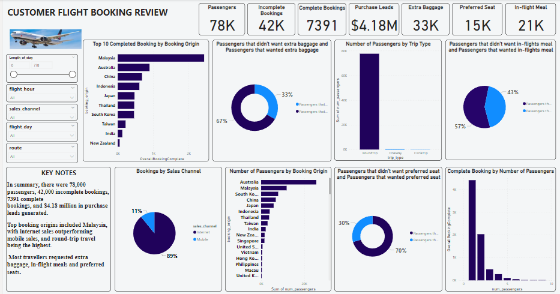

# Customers Flight Booking Insight

___

# Introduction: 

An online learning platform called CWW TECH AFRICA shared this dataset with her trainees. It included data on customers bookings, purchase leads, booking origin etc. The project seeks to shed light on customers preferences, booking trends, and prospective increases in flight booking sales. by investigating the influence of the customer's flight booking information across a range of booking origins, preferences, and sales channels.This project work helped in harnessing my Power BI skills.

# Problem Statement:

- What is the overall booking completion rate? 
- Top 10 Completed booking by booking origin?
- Are there differences in completion rates based on the number of passengers?
- Total amount of purchase leads? 
- Which sales channel had the highest completion rates? 
- what percentage of the passengers wanted extra baggage, in-flight meals, or preferred seats?
- Any further pertinent data-driven insights on customers flight booking report?

# Skills Demonstrated: 
- Dax,
- Quick measures.
   
# Data Sourcing: 

The data was provided by CWW Tech Africa. To clean, analyse, and visualise the data, I imported the CSV file that I had downloaded into Power BI.
Data transformation/cleaning: With the help of Power BI’s power query editor, the dataset was effectively cleaned and transformed.

# Data Modelling: 

Data modelling wasn't done because the dataset only had one table.

# Analysis and Visualization

___

- 78,000 total passengers, 42,000 incomplete bookings, 7391 complete bookings, and 4.18 million dollars in purchase leads were generated.
- The top 10 booking origins with clients that completed their bookings were Malaysia, Australia, China, Indonesia, Japan, Thailand, South Korea, Taiwan, India, and New Zealand, with Malaysia being the highest.
- Australia had the highest number of passengers, followed by Malaysia, South Korea, China and Japan.
- Internet sales generated 89% more bookings than mobile sales (11%), which had a lower percentage.
- Compared to one-way and circle trips, the number of passengers travelling round-trip was significantly higher.
- The majority of customers (67%) requested extra luggage, followed by in-flight meals (57%) and (70%) of the customers wanted preferred seats.

# Summary:

In summary, there were 78,000 passengers, 42,000 incomplete bookings, 7391 complete bookings, and $4.18 million in purchase leads generated. Top booking origins included Malaysia, with internet sales outperforming mobile sales, and round-trip travel being popular. Most travelers requested extra luggage, in-flight meals, and preferred seats.

# Conclusion and Recommendation

It is clear from the data that there is room for growth in both revenue generation and completed bookings. A significant market is Malaysia. 

- Marketing efforts should be concentrated on internet channels given the stark contrast between internet and mobile sales. It is notable and can influence route planning that round-trip flights are preferred.
- Offering package offerings that include extra luggage, in-flight meals, and preferred seats could increase income because they are often requested services. 
- Optimising the booking procedure is essential to lowering incomplete bookings. Partnerships in the top 10 booking origins and targeted marketing initiatives can increase conversions. The user experience must be enhanced, and services must be customised to passengers’ preferences, if future success is to be achieved.

